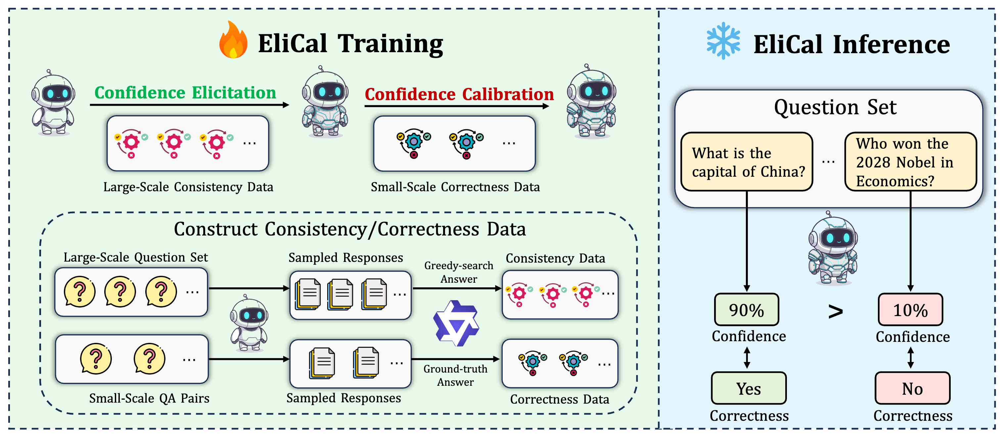
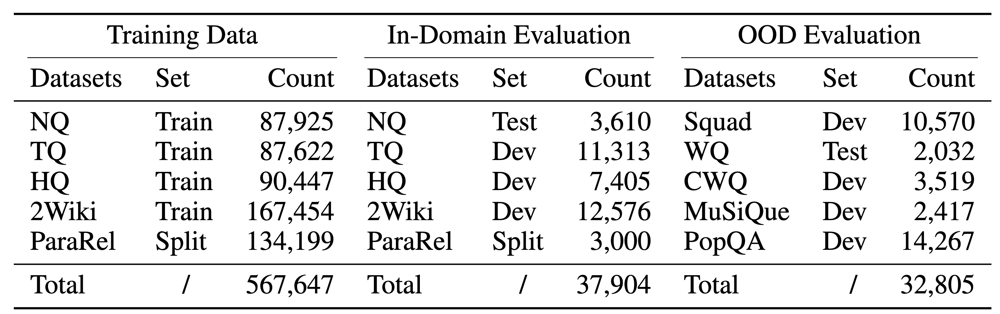

# Annotation-Efficient Universal Honesty Alignment

<p align="center">
  
</p>
<a href="https://huggingface.co/collections/Shiyunee/annotation-efficient-universal-honesty-alignment-68e0e648f9987db09bdc9162" target="_blank">
    
</a>
<a href="https://arxiv.org/abs/2510.17509" target="_blank">
    
</a>
<a href="https://opensource.org/license/apache-2-0" target="_blank">
    
</a>
<a href="https://github.com/ShiyuNee/Annotation-Efficient-Universal-Honesty-Alignment" target="_blank">
    
</a>

## 🔥 News

- **\[22 October, 2025]:** 🎉 We release HonestyBench and Trained Models on [Huggingface](https://huggingface.co/collections/Shiyunee/annotation-efficient-universal-honesty-alignment-68e0e648f9987db09bdc9162)!
- **\[21 October, 2025]:** 🎉 We release HonestyBench and Trained Models on [ModelScope](https://modelscope.cn/collections/Annotation-Efficient-Universal-Honesty-Alignment-2cf77d2590094d)!
- **[21 October, 2025]:** 🎉 We release the paper [Annotation-Efficient Universal Honesty Alignment](https://arxiv.org/abs/2510.17509)!

## Table of Contents

- [Annotation-Efficient Universal Honesty Alignment](#annotation-efficient-universal-honesty-alignment)
  - [🔥 News](#-news)
  - [🚀 Introduction](#-introduction)
  - [Setup](#setup)
  - [Data](#data)
  - [Inference](#inference)
  - [Honesty Alignment](#honesty-alignment)
  - [Evaluation](#evaluation)
  - [Results](#results)
  - [Citation](#citation)

## 🚀 Introduction

[Annotation-Efficient Universal Honesty Alignment](https://arxiv.org/abs/2510.17509) proposes how to efficiently train a universal honesty model. This repository contains all the data and code required to reproduce our results. If you would like to obtain **HonestyBench** and **our trained models**, please visit: [ModelScope](https://modelscope.cn/collections/Annotation-Efficient-Universal-Honesty-Alignment-2cf77d2590094d).

To support annotation-efficient training, we introduce **Elicitation-Then-Calibration (EliCal🛠️)**, a two-stage framework that

-  first **elicits internal confidence** using inexpensive self-consistency supervision
- then calibrates this confidence with a small set of correctness annotations. 

<p align="center">
  
</p>


To support a large-scale study, we release **HonestyBench**

- a benchmark covering ten free-form QA datasets with 560k training and 70k evaluation instances annotated with correctness and self-consistency signals. 

Experiments show that **EliCal achieves near-optimal alignment** **with only 1k correctness annotations** (∼0.18% of full supervision) and better alignment performance on unseen MMLU tasks than the calibration-only baseline, offering a scalable solution toward universal honesty alignment in LLMs.

> HonestyBench and the trained model parameters are **already prepared**, but due to connectivity issues with Hugging Face, we have not been able to upload them yet.

## Setup

First, we have to install all the libraries listed in requirements.txt

```bash
git clone https://github.com/Trustworthy-Information-Access/Annotation-Efficient-Universal-Honesty-Alignment
pip install -r requirements.txt
```

## Data

We provide the QA pairs required for the experiments in `/data`. These are converted from the original datasets using `data_preprocess/main.py`.

> The main purpose is to standardize the format, representing everything in `.jsonl`.
>  For datasets that include a test set, we use the test set for evaluation; otherwise, we use the dev set.

<p align="center">
  
</p>


## Inference

We first need to perform inference on the model to obtain:

- The model’s greedy search answer (temperature = 0)
- 20 sampled answers (temperature = 1)
- The consistency between each sampled answer and the greedy search answer (using Qwen2.5-32B-Instruct), which will be used to compute the model’s self-consistency confidence
- A correctness score for each of the above answers (using Qwen2.5-32B-Instruct to determine whether the generated answer matches the ground truth)

This can be achieved in one script (based on `vllm`) which executes the above four steps sequentially.:

```sh
cd infer_scripts
bash run_infer_consistency.sh
```

Note that you need to set the following parameters (you can see these parameters in the top of `run_infer_consistency.sh`):

```sh
GPU_NUMS=4 # specify how many GPUs will be used
BASE_PATH=/data/users/nishiyu # specify your base path for the models/datasets
RES_PATH=${BASE_PATH}/res/honesty_alignment/res # specify your output directory

model_name=Qwen2.5-7B-Instruct # specify your model name, used for QA
model_path=/data/models/${model_name}

# the model used for consistency checking and correctness judgment
check_model_name=Qwen2.5-32B-Instruct # used for consistency checking & correctness judgment
check_model_path=/data/models/${check_model_name}
batchsize=1024
```

`BASE_PATH` determines where your data is located, and `RES_PATH` determines where your output will be saved.

We collect these data and organize them into the **HonestyBench** format. For each model and each dataset, there is a `.jsonl` file, where each line is a dictionary in the following format:

> If your goal is not to reproduce the paper, but rather to obtain large-scale QA data along with consistency scores and generation probability information, then HonestyBench would be a good choice.

```json
{
    "question": <string>,                       # the question string
    "answer": [],                               # the ground-truth answers
    "greedy_response": [],                      # contains the greedy response string
    "greedy_correctness": 1/0,                  # correctness of the greedy response
    "greedy_tokens": [[]],                      # tokens corresponding to the greedy response
    "greedy_cumulative_logprobs": [number],     # cumulative log probability returned by vLLM for the entire sequence
    "greedy_logprobs": [[]],                    # per-token log probabilities returned by vLLM
    "sampling_response": [],                    # 20 sampled answers
    "sampling_correctness": [1, 0, 1, ...],     # correctness judgment for each sampled answer
    "consistency_judgement": [1, ...],          # consistency between each sampled answer and the greedy response
}

```

## Honesty Alignment

After completing the data preparation, we proceed with the honesty alignment training. Please note that the `RES_PATH` configured above is closely related to this step, so do not modify it arbitrarily. 

To preserve the model’s original capabilities while performing honesty alignment, we add **LoRA modules** to the model and include an additional **linear head** at the end to predict confidence scores. The architecture is:

```python
class LMWithVectorHead(nn.Module):
    def __init__(self, model_name, lora_config, output_dim=1):
        super().__init__()
        backbone = AutoModel.from_pretrained(model_name, device_map='cpu')
        # backbone.config.use_cache = False
        self.peft_model = get_peft_model(backbone, lora_config)
        self.config = backbone.config
        hidden_size = backbone.config.hidden_size
        self.vector_head = nn.Linear(hidden_size, output_dim)  # dim=1

    def gradient_checkpointing_enable(self, gradient_checkpointing_kwargs=None):
        self.peft_model.enable_input_require_grads()
        if gradient_checkpointing_kwargs is not None:
            self.peft_model.gradient_checkpointing_enable(**gradient_checkpointing_kwargs)
        else:
            self.peft_model.gradient_checkpointing_enable()

    def forward(self, input_ids, attention_mask=None, labels=None):
        outputs = self.peft_model(
            input_ids=input_ids,
            attention_mask=attention_mask,
            return_dict=True
        )
        # the internal state of the last input token (final layer)
        last_hidden = outputs.last_hidden_state  # [B, T, H]
        cls_hidden = last_hidden[:, -1, :]       # [B, H]
        logits = self.vector_head(cls_hidden)    # [B, 1]
        logits = torch.sigmoid(logits).squeeze(-1) 

        loss = None
        if labels is not None:
            loss_fct = nn.MSELoss()  # MSE
            loss = loss_fct(logits, labels)

        return CausalLMOutput(
            loss=loss,
            logits=logits
        )
```

We train three models to validate the effectiveness of EliCal. The base model parameters can be found under **Model URL** in the table below. The **LoRA modules** and **Linear Head** we trained are listed under **Parameters**.

| Model Name           | Model Url                                                  | Parameters                                                  | Parameters(ModelScope)                                       |
| -------------------- | ---------------------------------------------------------- | ----------------------------------------------------------- | ------------------------------------------------------------ |
| Qwen2.5-7B-Instruct  | https://huggingface.co/Qwen/Qwen2.5-7B-Instruct            | https://huggingface.co/Shiyunee/Honest-Qwen2.5-7B-Instruct  | https://modelscope.cn/models/ShiyuNee/Honest-Qwen2.5-7B-Instruct |
| Qwen2.5-14B-Instruct | https://huggingface.co/Qwen/Qwen2.5-14B-Instruct           | https://huggingface.co/Shiyunee/Honest-Qwen2.5-14B-Instruct | https://modelscope.cn/models/ShiyuNee/Honest-Qwen2.5-14B-Instruct |
| Llama3-8B-Instruct   | https://huggingface.co/meta-llama/Meta-Llama-3-8B-Instruct | https://huggingface.co/Shiyunee/Honest-Llama3-8B-Instruct   | https://modelscope.cn/models/ShiyuNee/Honest-Llama3-8B-Instruct |

You can reproduce them with the following command:

```sh
cd honesty_alignment
bash run_train_one_conf_and_eval.sh
```

This script allows you to run **both training and evaluation with a single command**. The first part of the command performs training, and the second part runs evaluation.

For training (**Elicitation + Calibration = EliCal**):

- **Elicitation stage**: Use all 560k training samples for elicitation. This stage does **not** require correctness labels.
- **Calibration stage**: Use different amounts of labeled data for the second-stage calibration (1k, 2k, 3k, 5k, 8k, 10k, 20k, 30k, 50k, 80k, 200k, 560k). This stage continues training from the model obtained after elicitation.
- **Calibration-Only training**:  Train using **only the labeled data** (without the elicitation stage). The dataset sizes are the same as in step 2.

Of course, the amount of training data can be configured in the script. `0` means using the **entire dataset (560k)**, and other values specify the number of samples directly.  For example, `1000` means **1k samples**.

> You need to specify the honesty_alignment/ddp.yaml

The second part of the script performs evaluation. It evaluates all models trained in the steps above and outputs the predicted model confidence. For each model and each dataset, the prediction results are written to a separate `.jsonl` file.

> You need to specify the honesty_alignment/ddp_eval.yaml

### Evaluation

After the training and confidence score prediction are completed, you can use the following command to perform score aggregation and evaluation.

```sh
bash run_eval.sh
```

This will compute **AUROC**, **ECE**, and **Alignment** simultaneously and save the results into three Excel files.
 Each Excel file contains **12 rows** (depending on how many training data sizes are evaluated). From top to bottom, each row corresponds to a different **amount of labeled data used during training**, in the same order as specified in your evaluation input. Each file has **5 columns**, which from left to right represent:

| Column   | Meaning                             |
| -------- | ----------------------------------- |
| N-Prob   | Normalized probability baseline     |
| Cons-Sem | Consistency with semantic agreement |
| Eli-Only | Elicitation-only model              |
| Cal-Only | Calibration-only model              |
| EliCal   | Full EliCal method                  |

If you see `_mlp` at the end of a script name, it means that only a classification head is added to the model without using LoRA. This is not the main focus of the paper, but simply an ablation study.

## Results

Experiments show that **EliCal achieves near-optimal alignment** **with only 1k correctness annotations** (∼0.18% of full supervision) and better alignment performance on unseen MMLU tasks than the calibration-only baseline, offering a scalable solution toward universal honesty alignment in LLMs.

> We **provide all the plotting functions** used in the paper in `honesty_alignment/draw.py`.
>
> For more details, please refer to our paper.

## Citation

If you find our repository useful, please consider giving it a star. 🚀✨. Please cite the paper if you find our work helpful.

```sh
@article{ni2025annotation,
  title={Annotation-Efficient Universal Honesty Alignment},
  author={Ni, Shiyu and Bi, Keping and Guo, Jiafeng and Tang, Minghao and Wu, Jingtong and Han, Zengxin and Cheng, Xueqi},
  journal={arXiv preprint arXiv:2510.17509},
  year={2025}
}
```

